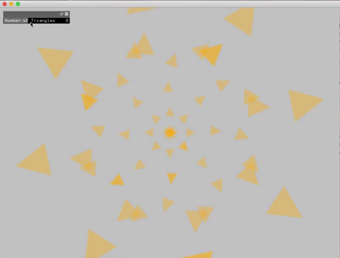

#### Recursion
1. number of triangles controlled by the slider
2. Triangle width/height, color, and transparency change with num of triangles
3. Triangles are drawn pointing outwards and make up a circle

