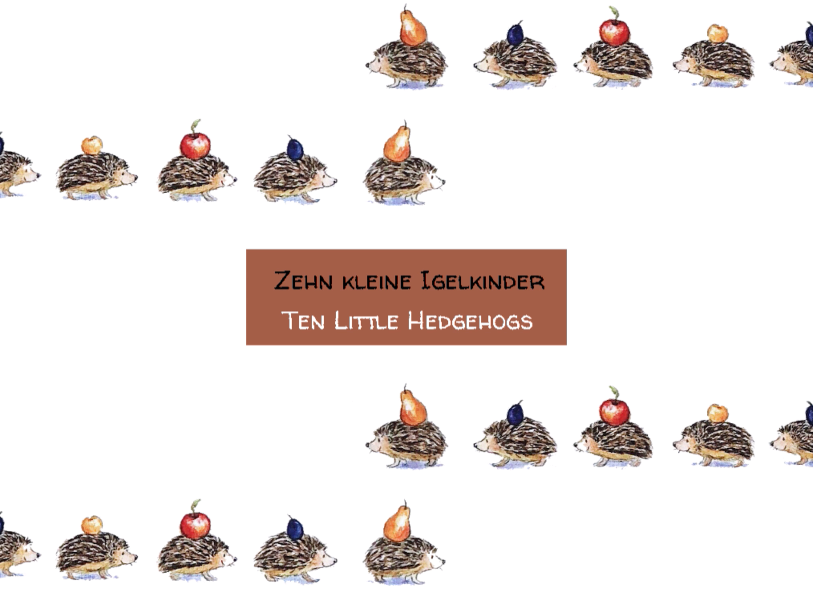

#### Final Projects
1. [A narrative](https://github.com/azuic/openframeworks/tree/master/Assignment_14/Project_1)
  * An animation of Bärbel Haas's Zehn kleine Igelkinder (10 Little Hedgehogs)
  * BGM sang by myself
  * A sweet reminder of my first few paces in learning German by reading some cute children books
  * May create some nostalgia for German speakers
  * [Watch on Vimeo](https://vimeo.com/335651239)
  

2. [A visualization](https://github.com/azuic/openframeworks/tree/master/Assignment_14/Project_2)
  * Real-time wind visualization using data from DarkSky API
  * Donut-shaped particle representation of wind speed, gust and bearing of New York, Ann Arbor, San Diego and Nantong, the four cities I am living/have lived in
  * The relative position matches the real geographical coordinates
  

3. [A game](https://github.com/azuic/openframeworks/tree/master/Assignment_14/Project_3)
  * Beats games are all over the place
  * A more difficult one can be disigned using FFT
  * Instructions: Hit space bar when the orange circle is close enought to the current frequency (the dark blue circle) coming out from the center. You will get a point if close enough.
  
  * [Watch on Vimeo](https://vimeo.com/335651501)
  * [Watch my roommate playing it. ](https://vimeo.com/335651173) SHE IS SO GOOD AT IT!!
