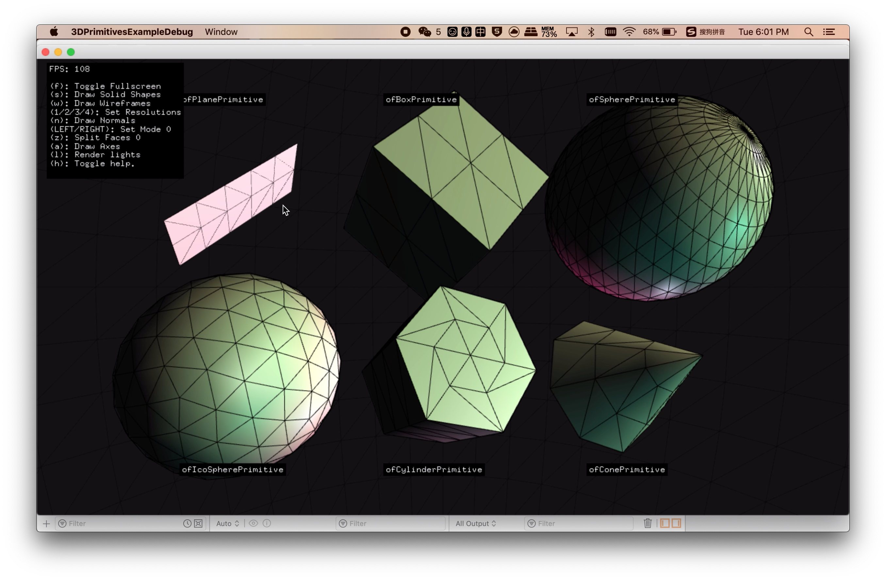

# Assignment 2
## C++

## Description
Testing OpenFrameworks Setup - 3D Primitives Example
interactivity with keyboard controls: adding/hiding visual components.
## Screenshots
#### Static

#### How it moves

