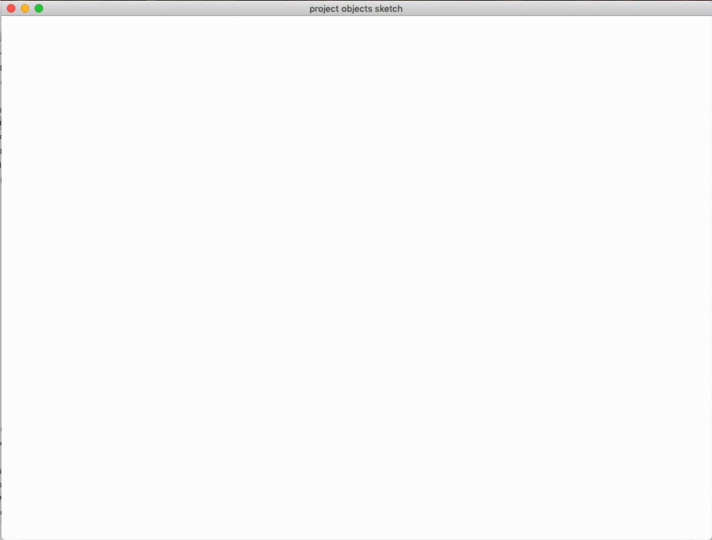
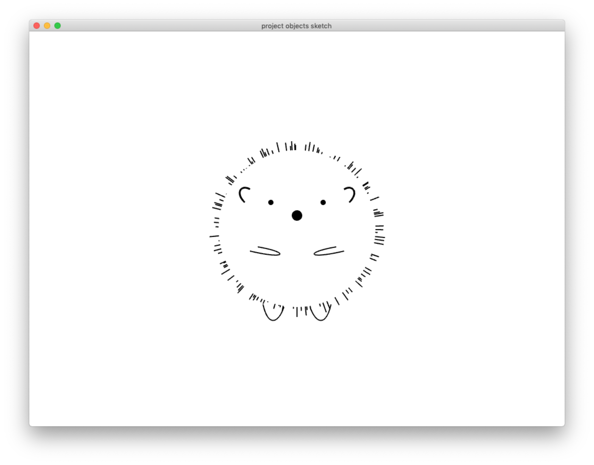
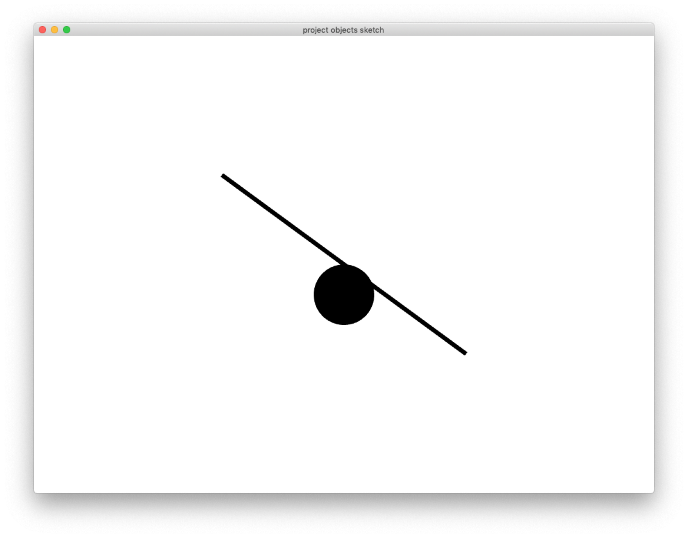
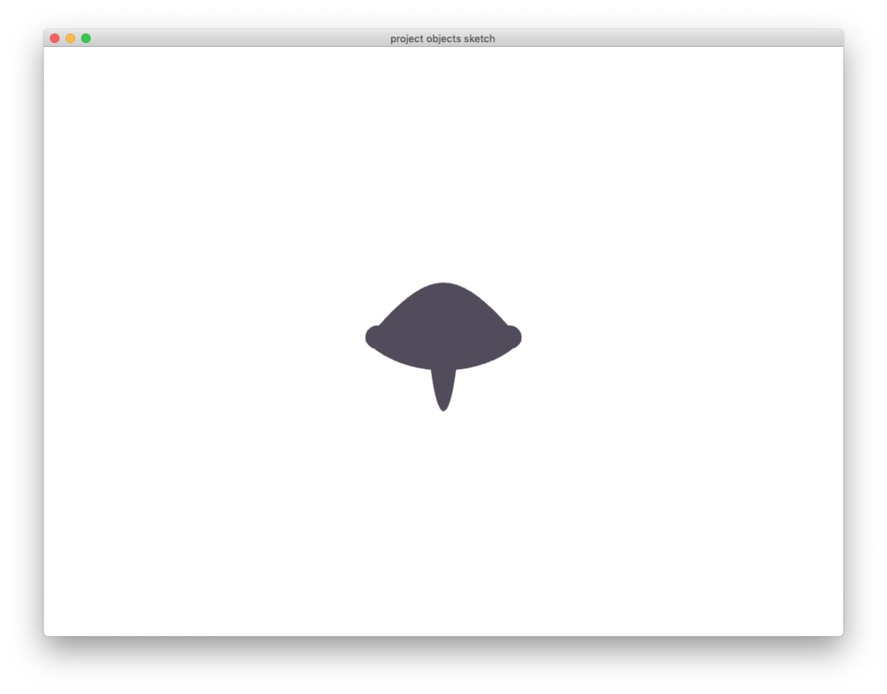
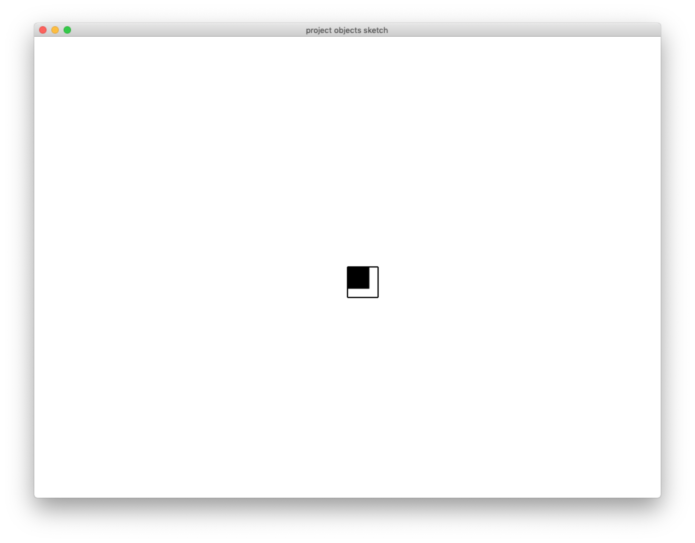

#### Project 1
##### *Zehn kleine Igelkinder by Bärbel Haas*
1. Audience: Kids but not necessarily kids. Also can be used for German language beginners. I remember using the childern's book by Janoch in my entry level German class.
2. An animated story of the *Ten Little Hedgedogs* and there will be a role play for users of the mother hedgedog to look for her ten kids.
3. Users can press keyboard to
4. Sketch:

#### Project 2
##### Data Visualization
1. Audience: Personalized experience for data visualization
2. An interacitve learning experience
3. Users can use the GUI controllers to adjust
4. Sketch:

#### Project 3
##### A music/vocal game
1. Audience: People who like to sing and play games
2. Input will be the amplitude taken from the mic, which will influence the size of the squares.
3. 
4. Sketch:

#### Object sketches

