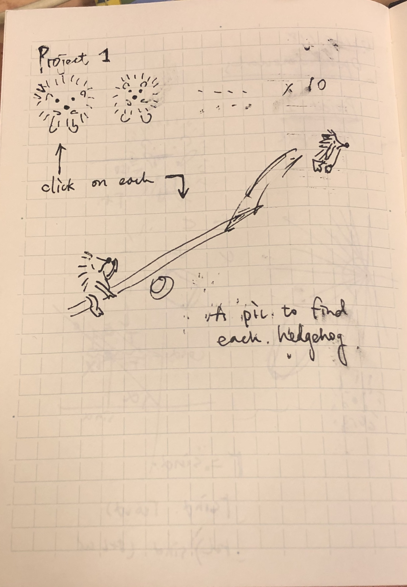
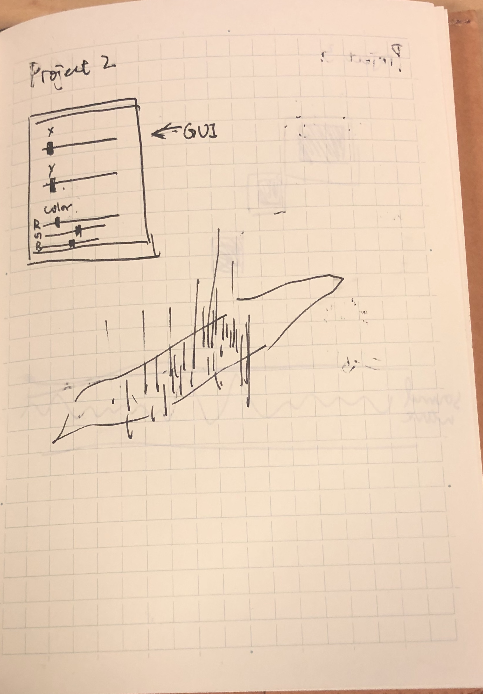
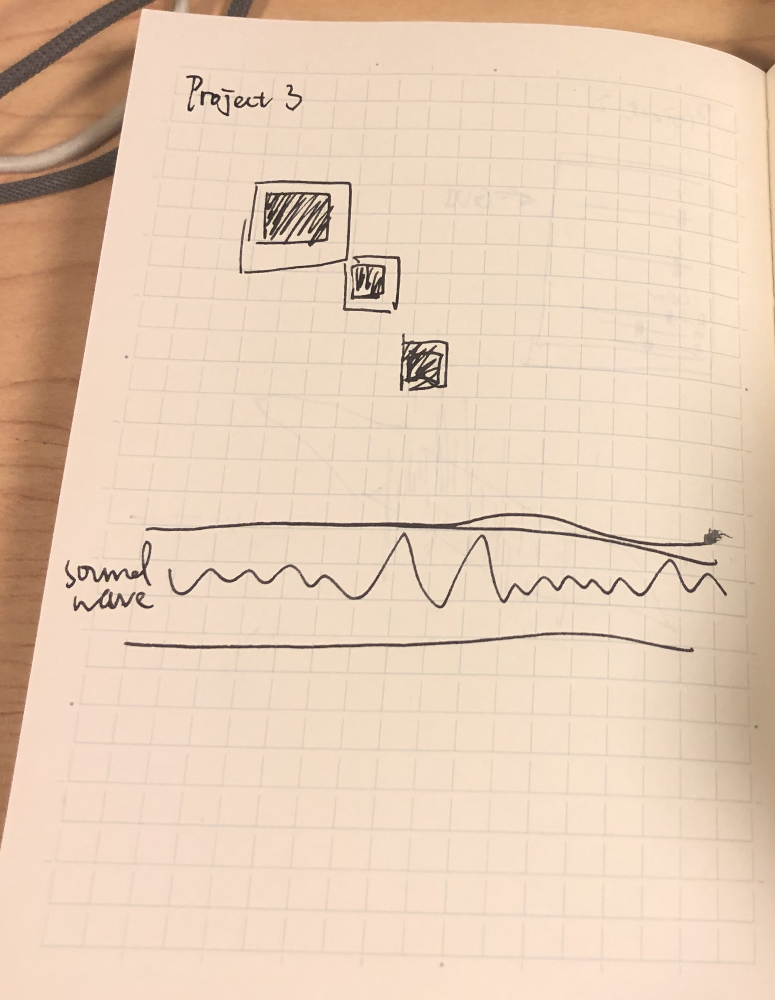

#### Project 1
##### *Zehn kleine Igelkinder by Bärbel Haas*
1. Audience: Kids but not necessarily kids. Also can be used for German language beginners. I remember using the childern's book by Janoch in my entry level German class.
2. An animated story of the *Ten Little Hedgedogs* and there will be a role play for users of the mother hedgedog to look for her ten kids.
3. Users can press keyboard to
4. Sketch:

   

#### Project 2
##### Data Visualization
1. Audience: Personalized experience for data visualization
2. An interacitve learning experience about the data in some 3D forms
3. Users can use the GUI controllers to adjust the displaying value spaces or colors etc.
4. Sketch:

   

#### Project 3
##### A music/vocal game
1. Audience: People who like to sing and play games
2. Input will be the amplitude taken from the mic, which will influence the size of the squares.
3. When users making an louder voice input, the shaded squares will be larger and the perfect fit will be the exact size of the outline squares.
4. Sketch:

   

#### Object sketches

