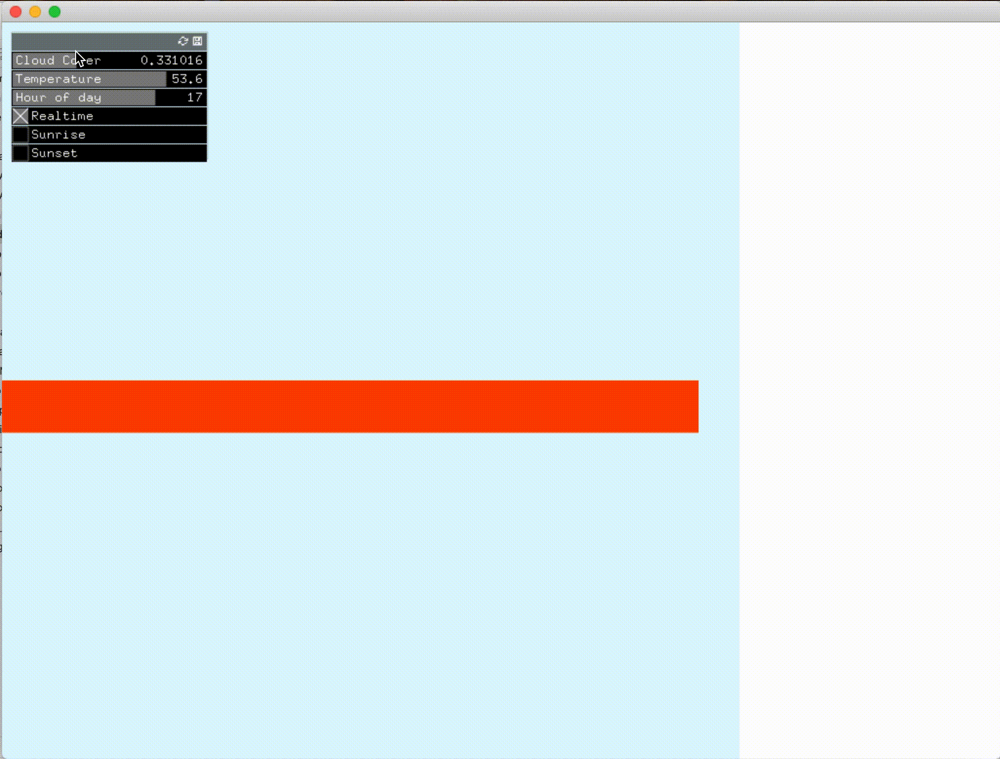

#### Experiments JSON with GUI controls
1. Cloudiness influence the opacity of background blue rectangle
2. Blue background positions in the corresponding hour
3. Red bar always shows the current time
4. Toggle Sunset and Sunrise to see the time
5. Temperature influences the width of the red bar
6. The start position of the GUI controls are always the real time information
7. The temperature slider range is the min and max temperature of the day

