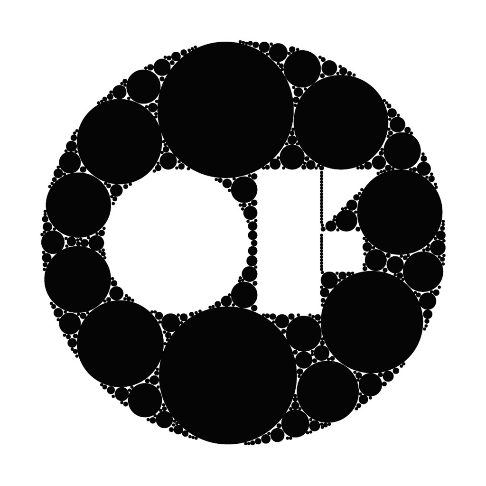

#### Creative Coding: OF
##### Spring 2019
##### Parsons School of design
###### Major: MS Data Visualization

Basics of C++ and use OpenFrameworks to program animation and interactions

##### Assignments
- [x] Week 1
- [x] Week 2
- [x] Week 3
- [ ] Week 4
- [ ] Week 5
- [ ] Week 6
- [ ] Week 7
- [ ] Week 8
- [ ] Week 9
- [ ] Week 10
- [ ] Week 11
- [ ] Week 12
- [ ] Week 13
- [ ] Week 14
- [ ] Week 15

